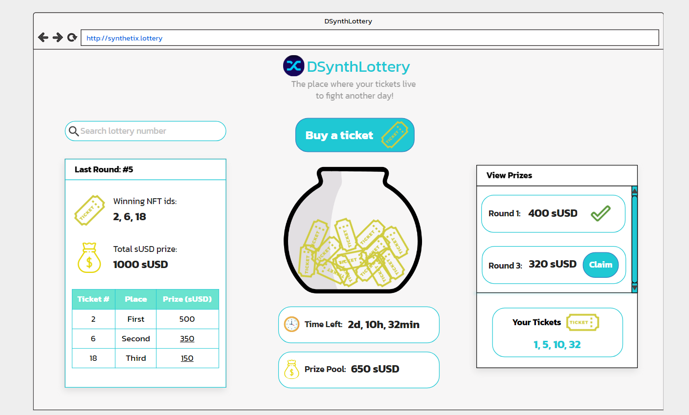

# dSynthLottery (Synthetix Lottery)
A participating solution in the Open DeFi Hackathon https://gitcoin.co/issue/snxgrants/open-defi-hackathon/8/100025689

### Design:



### Guide:

There is a single Lottery.sol contract. It inherits from Openzeppelin's ERC721.sol smart contract, the Ownable.sol smart contract and Chainlink's VRFConsumerbase.sol smart contract. The functionality that it offers is the following:

1) Buy a ticket:
   a) The function takes two parameters - the recipient, aka the wallet address that is to receive the ticket (in the form of a non-fungible token), and also the amount in
      sUSD that the function caller is willing to pay. The minimum is 1 sUSD;
   b) The amount paid in sUSD is added to the current lottery's pool. Each lottery has a duration of 6 hours, since it is a demo. In the live version one lottery is to run
      for a week;
   c) The NFT is minted and the new item id is returned.

2) Announce Winners:
   a) The function takes one parameter - the userProvidedSeed which Chainlink's VRFCoordinator.sol contract needs to kick off the randomization process;
   b) It is required that the caller of this function is the owner of the Lottery.sol contract. Also that the current lottery has expired and that the Lottery.sol
      contract has enough LINK tokens (0.1 LINK is needed) to cover the fee that is to be provided to Chainlink's oracle contract which takes care of the randomization
      for us;
   c) A request is sent to the Chainlink oracle. For it we need a keyHash which is used to identify the needed oracle, the above mentioned fee and the userProvidedSeed
      which could be any random uint256 number;
   d) After this request is submitted and processed, the callback function fulfillRandomness(bytes32 requestId, uint256 randomness) is called and 
      the requestId is the one which we have received from the requestRandomness(keyHash, fee, userProvidedSeed) function, whereas the randomness is 
      in fact our random number;
   e) Since we have 3 winners and not 1 we need to actually generate 3 random numbers. Instead of sending 3 separate requests which would cost us x3 LINK tokens
      as a fee, we simply take the random number from the VRF response and expand it to three values which is to be seen in the expandVRFResponse(bytes32 randomValue)
      function;
   f) After the three winners have been announced taking into account all existing NFTs, the lottery id is incremented and the next lottery receives an updated duration.

3) Claim prizes:
   a) We have three separate functions for each of the prizes;
   b) Each of them checks whether a given NFT id has won the corresponding prize for a given lottery id and whether the owner of that NFT is the one calling the function;
   c) The first place receives 50% of the sUSD in the corresponding lottery's pool;
   d) The second place receives 35% of the sUSD in the corresponding lottery's pool;
   e) The third place receives 15% of the sUSD in the corresponding lottery's pool;
   f) Afterwards the mappings for whether a token has won a prize for a given lottery id are set to false, so that the winner cannot claim funds for a second time;
   
4) The remaining functions are simply get ones used to read data from the smart contract

## Development
### Blockchain part - Smart Contracts

#### Setup for local blockchain environment

Make sure to install [Truffle](https://www.trufflesuite.com/docs/truffle/getting-started/installation). 
Then you can run the following commands to deploy the smart contracts and also test them.

```PS
npm install     # install dependencies such as @chainlink/contracts and @openzeppelin/contracts
truffle migrate --network [networkName] # build and deploy the smart contracts on a given network
truffle test    # run the tests
```

If at some point you would like to redeploy the contracts just run the command

```PS
truffle migrate --reset --network [networkName] # build and redeploy the smart contract - [networkname] could be for instance kovan
```

#### Learn More

Check out the [Truffle documentation](https://www.trufflesuite.com/docs/truffle/overview).
